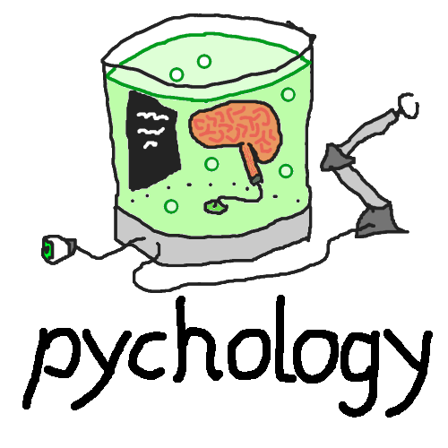

pychology
=========

Simple Python implementations of popular game AI techniques.

Current State:
* Behavior Trees: Release Candidate
* Utility AI: Beta
* Search: Alpha
* Blackboards: Alpha
* BrainJar: Beta


Behavior Trees
--------------

Behavior trees are tree structures that represent the logic of choosing
and switching the current task that a given entity should perform. The
tasks are situated at the leaves of that tree, and are defined by the
application that behavior trees are embedded in; In any given frame,
they can be active, done, or have failed. The trees inner leaves are
units of logic, and when the tree is called for execution, they route
that call through the tree to tasks, depending on current circumstances.
Multiple tasks may be executed each frame, and depending on their status
(active / done / failed), additional tasks may or may not be executed.
Note that "frame" does not actually have to correspond to a graphical
frame being rendered, or any semi-fixed time span; It is merely a good
shorthand for "an interval during which a tree is executed once."

For each task, `pychology` expects you to provide a function to call
when a task is started or continued, and that it returns one of the
above mentioned node states, namely `NodeState.ACTIVE`,
`NodeState.DONE`, or `NodeState.FAILED`. These functions then are
plugged into `pychology.behavior_trees.Action`.

Inner nodes may have a single child and do some logic; These are
called decorators, and do a lot of heavy lifting. They can change the
returning node state, prevent subtrees from being executed, check for
conditions, count how often or for how long a subtree has been active,
provide debug information, and much more. Depending on the exact type of
decorator, they may expect you to provide data or a function as well.

There are also nodes that (can) have multiple children. The two most
popular are the Chain (usually called Sequence), which executes a series
of tasks (or rather subtrees) one after the other, and Priorities (also
called Selector or Fallback) which tries running one subtree after the
other until one reports something other than failure. Another node type
is Parallel, which executes all of its children until one fails or all
are done. Note that this is not parallelism in the sense of bits of code
being executed at the same time on the CPU, but the logical parallelism
of multiple subtrees all being executed within the span of a frame.

The class `pychology.behavior_trees.BehaviorTree` can act as a root node
that automatically resets the tree's state after it has finished or
failed, and can also run arbitrary code to integrate with the wider
environment that the tree is embedded in.

An example on how to go through a door:

```python
BehaviorTree(
    Chain(
        DoneOnPrecondition(                  # The first task is done
            is_door_open,                    # if the door is open,
            Priorities(                      # otherwise try to
                Action(open_door),           # open it
                ReturnActiveOnDone(          # or try again after
                    Action(unlock_door),     # unlocking it,
                ),
                ReturnActiveOnDone(          # or try again after
                    Action(pick_door_lock),  # picking the lock,
                ),
                FailOnPrecounter(            # or try
                    4,                       # three times to
                    Action(kick_in_door),    # kick in the door.
                ),
            ),
        ),
        Action(walk_through_door),           # Afterwards, go through.
    ),
)
```


Utility AI
----------

While Behavior Trees are a powerful way to structure an AI's reasoning,
they are basically a thin syntactic layer that adapts the concepts of
flow control to an environment in which time exists. Implementing a
Behavior Tree is conceptually not too different from hardcoding an AI's
behavior in code; There is precious little abstraction going on.

Utility AI is a way to make the decision on which action to pursue based
on the more abstract concept of considerations. The basic approach is
this:
* A `Reasoner` is an AI that has a set of `Options`, which are the
  available actions.
* Each `Option` is assigned a set of `Considerations`, which calculates
  a utility value based on the current circumstances. Typically, these
  values are floating point numbers in the `[0.0, 1.0]` range.
* To prepare for choosing an `Option`, for each `Option`, the utility of
  each of its `Considerations` is calculated, and the results are
  multiplied, yielding the utility of the `Option` as a whole.
* There are two basic ways to make the final choice:
  * Absolute value: Just choose the highest-scored `Option`.
  * Relative value: A weighted random choice is made between the
    `Options`, with the weight of each being its utility value.

Both of these approaches to choosing an `Option` have drawbacks. When
using only the absolute value, the AI will behave optimally and
predictably, but this can also be rather boring in the context of games.
When using only the relative value, low-valued `Options` may be selected
because the choice is in the end random, resulting in an AI that acts
chaotically and disorganized.

A typical approach to tune the behavior within this spectrum is to take
only a subset of `Options` into consideration for the choice, e.g. "the
three highest-valued ones" ot "those with a value of at least 80% of the
highest-valued one", and make a weighted random choice between these.

`pychology` uses the Dual Utility Reasoner. Its `Options` use two values
to express their utility, namely rank and weight. Rank is used for the
preselection, in that only the `Options` with the highest rank will be
considered for selection; Weight operates just like utility for the
purpose of then making the final choice. `Considerations` in turn return
three values, namely
* rank, where an `Option's` rank is the highest of the ranks of its
  `Considerations`,
* bonus, which is typically 0.0 for each consideration except the tuning
  consideration, where it is 1.0; The boni of all considerations get
  summed up, typically resulting in 1.0. This then acts as a factor to
  the `Option's` weight. While best ignored most of the time, the bonus
  can be used as a way to give an option a lot more weight under some
  circumstance.
* multiplier, which is basically the utility as laid out above, and gets
  multiplied with the bonus.

Looked at again from the bottom up, ...
* `Considerations` return rank, bonus, and multiplier, which an...
* `Option` combines into rank and weight by using the highest rank
  value, and the sum of the boni times all multipliers.
* The `Reasoner` then takes the `Options` with the highest rank and
  makes a weighted random choice between them; In the case that all
  options with the highest rank have a weight of `0.0`, it will consider
  the next-highest, and so on.
  FIXME: If all ranks are empty, should that throw an `Exception` or
  return a default plan? Right now, it causes a `ValueError` in the
  decider.

With this approach, a designer can sort `Options` into ranks by their
urgency (which may vary based on circumstances), and then design their
utility as usual, resulting in a behavior that is both superficially
believable and apparently spontaneous.

Additionally, the Dual Utility Reasoner allows to address several
recurring problems in behavior design by using a set of design patterns
for utility functions.


Directed Graph Search
---------------------

Consider games like Tic Tac Toe, Four in a Row, Checkers, Chess, Go.
They can all be modeled in terms of current states, actions that players
are able to take when the game is in a certain state, and successor
states that the game will be in if a certain set of actions is taken.
This principle also applies to complex video games, especially when it
comes to problems like pathfinding and action planning.

Game states can be considered as nodes in a graph, and the corresponding
valid actions as directed edges from node to node. To play a game like
that well then means to find a path through the graph one step at a
time, trying to steer the movement into a preferable area of the graph
that will provide the most beneficial outcome, while opposing players
try to steer it into areas preferable to themselves. Graph search then
is the application of raw computing resources to build the graph of
possible future game states out from the current state, and finding the
paths through it that lead to the optimal possible future state. This
search can be improved on both by clever optimizations on the search
itself, and through expert knowledge expressed as heuristic functions.

To make a problem tractable to search, it has to be formulated as
functions:

* `players()` returns a list of players in the game,
* `game_winner(state)` determines whether a player has won in the given
  state,
* `legal_moves(state)` gives a list of actions that each player can
  take, and
* `make_moves(state, moves)` returns the state that the game is in when
  the players make the indicated moves.

In addition to these core functions, different aspects that may be used
in the search may require additional functions:

* `hash_state(state)` creates a value that identifies the state. It
  should do so uniquely, meaning that no two states have the same hash;
  However, hash functions for which that is not guaranteed have been
  used successfully, e.g. Zobrist hashing for chess.

  This function is used by the `TranspositionTable` implementation for
  state storage, allowing states to be stored as a directed graph
  instead of a tree, which allows for states to be reused, should
  different sequences of moves lead to them.

  FIXME: There are still some occurrences of `hash_state` in the code
  that are not yet contained in the `TranspositionTable`.
* `evaluate_state(state)` generates a numerical value that expresses how
  good the given state is for the player; If one of two states is better
  than the other, its evaluation should be higher than the other's.

  This entry is special as the game should provide a dictionary of
  evaluation functions. This allows for configuring the playing strength
  of the search.

  FIXME: This function should default to using the result of
  `game_winner` to generate basic valuations (`math.inf` / `-math.inf` /
  0 for winning, losing, and a draw respectively), so that providing an
  evaluation function truly is optional. Similarly the MCTS evaluation
  function should be selectable without being specified in the game.
  Both these features still need to be implemented.

Finally, there is a set of functions used by the `repl.py` command line
tool to provide a textual interface to games.

* `initial_state()` defines the state of the board at the beginning of
  the game.
* `query_ai_players()` returns a list of players that should be played
  by the search.
* `visualize_state(state)` unsurprisingly outputs the state for the
  user.
* `query_action()` asks the user(s) which move they want to make.

All of these functions then are put together in a class which gets
passed to the search on its creation time, together with the current
state and the player for which the search should find the best action.
In this example, we use a random mover "search":

```python
from pychology.search import RandomAI


search = RandomAI(game, state, player)
action = search.run()
```

To assemble and configure a search, we use the `Search` class as the
base, and add classes that implement aspects of the search, which the
base class itself does not; It only manages the core cycle of the graph
search algorithm, which consists of...

* choosing the state(s) to expand during this cycle, and for each of
  them...
* determining whether any player has won the game in it (and doing
  nothing with it if that is the case; Terminal states can not be
  expanded further),
* determining the combinations of actions that players can / might want
  to take in this state, and for each of them...
* determining the successor state that doing so would lead to,
* storing that state and transition, 
* and if the state is not known yet, evaluating the state and enqueue it
  for expansion.
* Finally, once all actions are processed and all successors created and
  evaluated, the original state is re-evaluated (now based on its
  successors' values, not its own), and the resulting value is
  recursively passed on to its parent(s), which then is also
  re-evaluated, and so on, until the updated value has reached every
  node for which it is relevant.

The core loop itself is embedded into a loop which steps it until some
termination condition is met, e.g. the search graph is fully expanded,
has grown beyond a certain number of nodes, or has completely searched
the graph up to a certain depth.

However, it specifies nothing at all about how each step in particular
should be performed, and those implementation details can radically
influence how the search performs in different scenarios. They can be
categorized into several aspects of the search, each encapsulating one
to three functions alluded to in the explanation of the core loop:

* Storage: Sets up the data structure in which states and the
  transitions between them are stored, allows for those steps to be
  done, and manages the backpropagation of updated state evaluations
  through the relevant nodes. Currently, only a transposition table is
  implemented.
* Tree expansion: Steps the core loop, within the limits it implements.
* State selection: Typically a FIFO or LIFO queue, making the search
  happen breadth-first or depth-first. A priority queue (e.g. for A*) is
  planned.
* Action expansion: Creates a list of move combinations that players may
  want to take. Typically, all legal possibilities are considered, but
  if doing so leads to too high a branching factor, functions that
  leverage expert knowledge for a game (or, theoretically at this time,
  machine learning models) may create more selective lists.
* State evaluation: A game's evaluation functions provide a value for a
  state from each player's perspective. This capability combines those
  values into one overall score, as seen from the perspective of the
  player for who we are doing the search. For example, in the game Four
  in a Row, each player's heuristic evaluation score can be based on how
  many lines there are with which the player can place winning lines,
  and how many pieces they have put into each of those lines already.
  The state evaluation then can, for example, subtract the opponent's
  value from the searching player's value, making the search consider
  blocking the opponent's lines as valuable as preparing one's own
  lines; This approach considers games to be zero sum games.
* Action evaluation: Once a state has been expanded, each action that a
  player can take can be valued based on the states that it can lead to;
  These may be multiple states if other players may also contribute
  actions to the move. By extension, the expanded state itself is also
  given a value based on those of the actions. The typical approach to
  this is minimax (the game theory one, not the tree search algorithm
  one which is based on the former). We assume that whatever we do, the
  opponent will do whatever is worst for us and selects the transition
  which will minimize the score for our action. Between those options we
  then choose the action providing the highest score (the best of all
  the worst options), or, more precisely, store all the best actions (as
  multiple may have the same value) for later action selection.
* Action selection: Chooses the action to take based on the current
  knowledge, randomness, or whatever else may come to mind.
* Analysis: With this optional capability, information about the search
  that was just performed may be extracted. Useful for debugging and
  performance measurement.


And when we put this all together:

```python
from pychology.search import TranspositionTable, NodeLimitedExpansion,
    SingleNodeBreadthSearch, AllCombinations, ZeroSumPlayer, Minimax,
    BestMovePlayer, Search


class MySearch(
    TranspositionTable,       # Storage: Directed graph
    NodeLimitedExpansion,     # Tree expansion: Abort the expansion loop
                              # once the limit set by the `node_limit`
                              # has been reached or exceeded.
    SingleNodeBreadthSearch,  # State selection: Expand one node at a
                              # time, in the order that successors are
                              # found in
    AllCombinations,          # Action expansion: Consider all
                              # combinations of legal moves.
    ZeroSumPlayer,            # State evaluation: A state's value is the
                              # player value minus all opponent values.
    Minimax,                  # Action evaluation: Expect opponents to
                              # make the move worst for us, and us to
                              # make the one best for us.
    BestMovePlayer,           # Action selection: Choose the highest-
                              # valued successor to move to.
    Search,
):
    node_limit = 10000


search = MySearch(game, state, player)
action = search.run()
```


TODO
----

* Project
  * Packaging
* Hierarchical Finite State Machines (HFSM): Everything
* Behavior Trees
  * Node types
    * Weighted Random Choice Multinode
    * Plugin point for adding subtrees at runtime; Might be sensible to
      have as a universal property?
  * Tooling
    * De-/Serialization
    * Debug
      * Recording activation, return values, and resets frame by frame
    * Tree visualization and editing in Panda3D
  * Documentation
    * Separate course-style page
* Search
  * Algorithms
    * Alpha-Beta Pruning
    * Quiescence Search
    * Bidirectional Search
    * Pondering
      * State graph garbage collection
      * Reevaluation on change of player
    * Demonstrate machine learning wherever applicable
    * Counterfactual Regret Minimization
      * https://en.wikipedia.org/wiki/Regret_(decision_theory)
      * http://modelai.gettysburg.edu/2013/cfr/cfr.pdf
      * https://poker.cs.ualberta.ca/publications/NIPS07-cfr.pdf
      * https://towardsdatascience.com/counterfactual-regret-minimization-ff4204bf4205?gi=a09c56e9300c
    * Action selection: Shortest beat path
  * Search capabilities
    * State selection
      * Add priority queue
    * State evaluation
      * Rip win-based and MCTS evaluations out of games
    * Action evaluation
      * https://www.researchgate.net/profile/Paul-Purdom/publication/220091335_Experiments_on_Alternatives_to_Minimax/links/0912f51470146478b1000000/Experiments-on-Alternatives-to-Minimax.pdf
    * Analysis
      * Add timing again
      * Provide API to query for collected data
      * Make printing optional
  * Tooling
    * REPL
      * Command line arguments
	* Make more things available through `repl.assemble_search`.
      * Tournaments
        * Have visualizations for other games than "two players, draws
	  possible".
	* Reorder matches to build up results equally over all of them,
	  making results human-accessible earlier.
        * CSV / JSON output
  * Documentation
    * Separate course-style page
    * Docstrings; Especially descriptions of lists / dicts transferred.
  * Hacks
    * Early termination of expansion if the root node has only one
      action available.
    * A state, once expanded, is not used anymore, and can be removed
      from memory; Only its metadata is what we are after.
  * Compilation: Refactor code for use with Cython / PyPy / mypyc and
    test speed improvements
* Planning
  * Goal-Oriented Action Planning (GOAP): Everything
  * Hierarchical Task Planning (HTN): Everything
* [Whatever this is](https://www.youtube.com/watch?v=Z-xU96pAuqs)
* Tolman-Eichenbaum machine
  * https://web.archive.org/web/20200325015457id_/https://www.biorxiv.org/content/biorxiv/early/2019/09/16/770495.full.pdf
  * https://www.ncbi.nlm.nih.gov/pmc/articles/PMC7707106/
